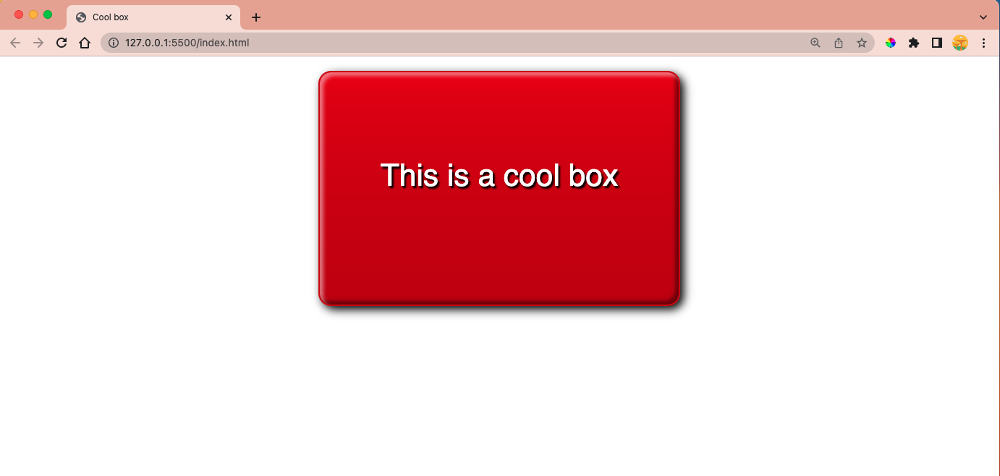

# Final Project (preview)
Link: https://jasheloper.github.io/css-box-project/

 

 

## Objective
To test comprehension of the CSS box model and other box-related features such as borders and backgrounds.

 

## Project Guidelines
https://developer.mozilla.org/en-US/docs/Learn/CSS/Building_blocks/A_cool_looking_box